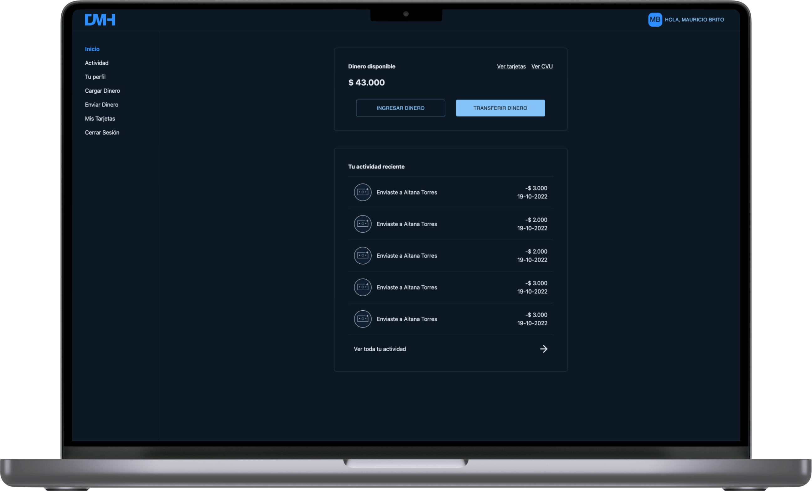

# Digital Money House Frontend
---



---
### Tabla de contenido

- [Descripción](#descripción)
- [Como instalar](#como-instalar)
- [Autor](#autor)

---

## Descripción

Temática: Billetera Digital (Digital Money House  )

#### Tecnologías

- React.js
- React Context API
- Typescript
- TailwindCSS
- Material UI
- React Credit Card 
- React Router Dom V6
- JSON Server
- JSON Server Auth

[Volver arriba](#digital-money-house-frontend)

---

## Cómo ejecutar

El frontend consume el API Gateway real en `http://localhost:8080/api`. No se utiliza `json-server` ni el comando `fake-api`.

### Requisitos

- Node.js y npm
- Backend iniciado: Eureka, Users Service, Account Service, Auth Service y API Gateway.
- Docker con MySQL, Keycloak y MailHog activos.

### Instalación

Desde la carpeta `FrontEnd`:

```bash
npm install
```

### Ejecutar en desarrollo

```bash
npm start
```

La aplicación estará disponible en `http://localhost:3000`.

### Generar el build de producción

```bash
npm run build
```

El build se genera en la carpeta `build`, que no se versiona.

### API utilizada

| Funcionalidad | Endpoint |
| --- | --- |
| Registro | `POST /api/auth/register` |
| Inicio de sesión | `POST /api/auth/login` |
| Cierre de sesión | `POST /api/auth/logout` |
| Recuperación de contraseña | `POST /api/auth/password-recovery/*` |
| Verificación de correo | `POST /api/auth/email-verification/*` |

Los servicios del backend y su infraestructura están en la carpeta raíz del repositorio.
---

## Autor

- Propiedad de Digital House ❤️​

[Volver arriba](#digital-money-house-frontend)
