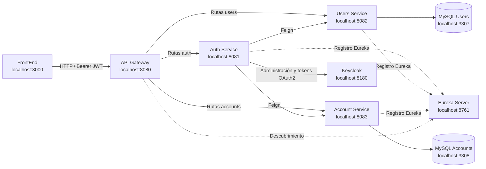

# Diseño de infraestructura - Sprint 1

## Objetivo

La infraestructura permite ejecutar Digital Money House localmente mediante microservicios independientes, autenticación centralizada y una base de datos separada para cada dominio.

## Componentes

| Componente | Puerto | Responsabilidad |
|---|---:|---|
| FrontEnd | 3000 | Interfaz del usuario |
| API Gateway | 8080 | Punto único de entrada, CORS, enrutamiento y validación JWT |
| Eureka Server | 8761 | Registro y descubrimiento de microservicios |
| Auth Service | 8081 | Registro, login, logout e integración con Keycloak |
| Users Service | 8082 | Perfil de usuario y roles de negocio |
| Account Service | 8083 | Cuenta digital, CVU y alias |
| Keycloak | 8180 | Identidad, credenciales, roles y emisión de tokens |
| MySQL Users | 3307 | Base de datos exclusiva de usuarios |
| MySQL Accounts | 3308 | Base de datos exclusiva de cuentas |

## Boceto de red y componentes

## Flujo de registro

1. El FrontEnd envía los datos a Auth Service por API Gateway.
2. Auth Service valida que email y DNI estén disponibles.
3. Auth Service crea la identidad y asigna el rol `USER` en Keycloak.
4. Auth Service crea el perfil en Users Service.
5. Auth Service crea la cuenta digital en Account Service.
6. Account Service genera CVU y alias desde `alias-words.txt`.
7. Keycloak entrega access token y refresh token.
8. Auth Service responde al cliente sin exponer contraseña.

## Seguridad

- Keycloak administra credenciales, usuarios y roles.
- Los servicios validan JWT emitidos por Keycloak.
- Registro y login son públicos.
- Perfil, cuenta y logout requieren Bearer token.
- Auth Service utiliza un cliente técnico para operaciones administrativas en Keycloak.
- La contraseña no se guarda en las bases de datos de Users ni Accounts.

## Persistencia

Cada microservicio posee su propia base de datos:

- Users Service administra `users_db`.
- Account Service administra `accounts_db`.
- Keycloak administra su propio almacenamiento interno.

Esta separación evita acceso directo entre servicios a bases de datos ajenas y conserva la independencia de cada dominio.